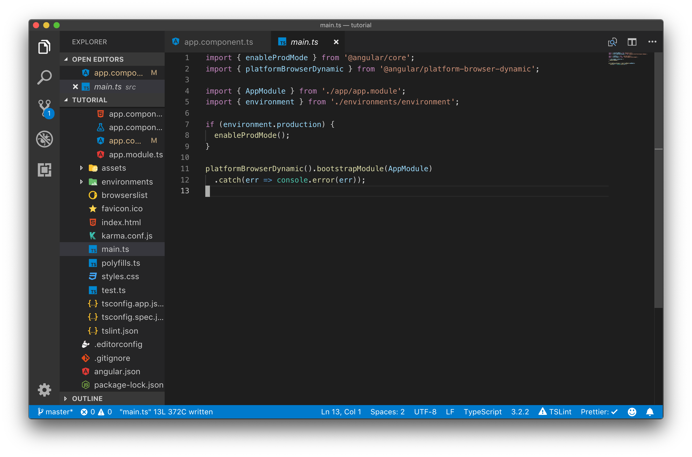

# Alur Starting Aplikasi Angular

Aplikasi angular dimulai dari file main.ts, pada file inilah dilakukan bootstraping angular. Untuk mempermudah pemahaman terhadap alur ini bukalah file main.ts pada project anda.



Pada kode program di atas dapat dilihat pada file main.ts hanya terdapat statement import dan fungsi untuk memulai bootstrapping.

```typescript
import { enableProdMode } from "@angular/core";
import { platformBrowserDynamic } from "@angular/platform-browser-dynamic";

import { AppModule } from "./app/app.module";
import { environment } from "./environments/environment";
```

Pada statement import diatas dimulai dengan mengimport enableProdMode, enableProdMode ini adalah library untuk mengaktifkan production mode artinya aplikasi angular yang anda jalankan sudah pada tahap production dimana pada tahap ini proses checking yang biasanya digunakan pada development mode sudah dimatikan.

Selanjutnya yang di import adalah platformBrowserDynamic, library ini digunakan untuk melakukan kompilasi kode program angular di browser. Perhatikan bahwa di main.ts yang di import adalah platformBrowserDynamic bukan platformBrowser.

Selanjutnya yang di import adalah module utama atau AppModule, khusus pada file ini hanya di load root module nya saja jadi pada file ini tidak boleh ada module lain. Jika anda membagi aplikasi angular ke beberapa module maka module lain ini harus menjadi anak /child dari root module ( AppModule)

```typescript
if (environment.production) {
  enableProdMode();
}

platformBrowserDynamic()
  .bootstrapModule(AppModule)
  .catch(err => console.error(err));
```

Selanjutnya dilakukan checking environment dan yang paling utama adalah dipanggil method platformBrowserDynamic yang melakukan bootstrap module AppModule. Dari AppModule bootstraping dilanjutkan ke AppComponent
