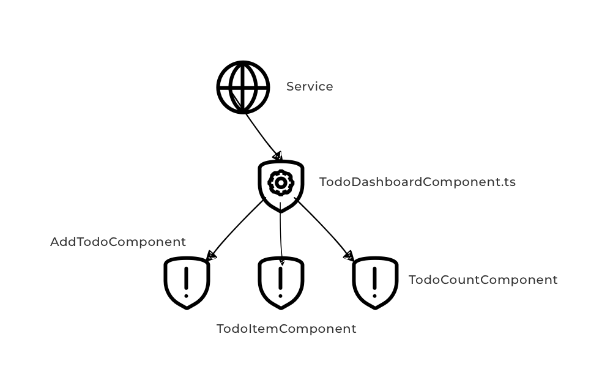

# Container vs Presentational

Pada arsitektur angular terdapat dua jenis component, yang pertama adalah container dan yang kedua adalah component.

- Container (Container Component)
- Component (Presentational Component)

## Container

Container adalah component yang berkomunikasi dengan service dan bertugas melakukan rendering terhadap child component nya.

## Presentational

Presentational Component adalah component yang menerima input dari Container dan hanya bertugas menampilkan data, tanpa dapat berkomunikasi dengan service. Component ini memiliki input dan melakukan emmit change melalui event output.

## Latihan Container / Presentational

Perhatikanlah kembali tugas dari materi hari sebelumnya kemudian mari kita membahas bagaimana membagi component pada aplikasi tersebut.

Pada hari sebelumnya semua kode program masih di simpan di app.component.ts. Pada hari ini kita membahas bagaimana cara memisahkan component menjadi container atau presentational component.

Dari screenshot aplikasi pada hari pertama anda dapat melihat sebagai berikut :

Dari illustrasi ini kita dapat membagi tampilan di atas menjadi beberapa component, yaitu :

- TodoComponent 
- AddTodoComponent
- TodoCountComponent
- TodoItemComponent

Dari ke empat component ini dapat di pisahkan menjadi Container dan Presentational Component. Yang menjadi Container Component adalah :

- TodoComponent 

Dan yang menjadi Presentational Component adalah :

- AddTodoComponent
- TodoCountComponent
- TodoItemComponent

Seperti yang sudah dijelaskan diatas Container Component menjadi yang bertanggungjawab dalam mengatur komunikasi dengan service dan melakukan rendering terhadap child component dalam hal ini Presentational Component.

Jadi TodoComponent mempunyai service yang mengatur data, serta mempunyai child AddTodoComponent, TodoCountComponent dan TodoItemComponent.

AddTodoComponent adalah component yang memiliki tampilan add todo dan mempunyai output yang melakukan event emitter ke appComponent.

TodoCountComponent adalah component yang memiliki tampilan counter todo. Yang berbeda pada component ini adalah dia tidak memiliki output namun memiliki input berupa data array Todos (proses melakukan count dan menampilkan dilakukan di component ini)

TodoItemComponent adalah component yang menampilkan satu item component yang memiliki input berupa data satu item todo serta memiliki output berupa event untuk mengupdate status finished / unfinished

## One Way Data Flow

One way data flow merupakan salah satu cara mengatur alur data pada angular. Selain one way data flow juga ada two way data flow yang sudah dijelaskan pada hari pertama.

Dengan menggunakan konsep one way data flow perubahan data dari satu Presentational Component baru akan di simpan secara permanent melalui service setelah Presentational Component mengirimkan event emitter ke Container Component, dimana pada Container Component baru data tersebut di persistence kan melalui service.

## Latihan One Way Data Flow

Buatlah One Way Dataflow yang sesuai untuk Container Component dan Presentational Component yang sudah di jabarkan di atas.

ContainerComponent

| Component     | Input | Output / Event Emitter |
| ------------- | :---: | ---------------------: |
| TodoComponent |   -   |                      - |

- Service untuk mengambil data todo
- Service untuk delete todo
- Service untuk edit todo
- Service untuk add todo
- Service untuk toggle todo

Presentational Component

| Component          |  Input   | Output / Event Emitter |
| ------------------ | :------: | ---------------------: |
| TodoCountComponent | Todos[ ] |                      - |
| TodoItemComponent  |   Todo   |         ToggleFinished |
| AddTodoComponent   |    -     |                AddTodo |
