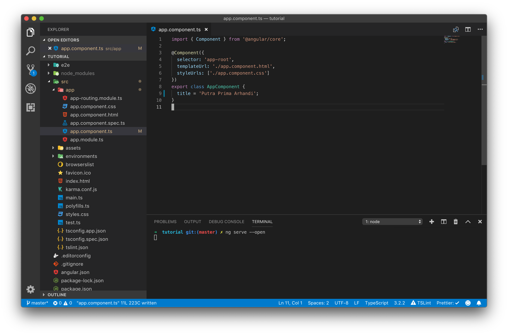

# Component Basic

Component adalah bagian penting dari sebuah aplikasi angular, sebuah aplikasi yang dikembangkan dengan menggunakan angular terdiri dari beberapa component yang bekerja sama.

## Membuat Component

Untuk memulai membuat component bukalah file app.component.ts pada folder app. Perhatikan kode program yang ada :

```typescript
import { Component } from "@angular/core";

@Component({
  selector: "app-root",
  templateUrl: "./app.component.html",
  styleUrls: ["./app.component.css"]
})
export class AppComponent {
  title = "tutorial";
}
```

Kode program diatas adalah kode program minimal untuk membuat sebuah komponen, minimal terdiri dari sebuah class yang memiliki decorator @Component.

Untuk melatih proses pembuatan component hapuslah semua kode program pada app.component.ts

Langkah pertama tambahkan statement import

```typescript
import { Component } from "@angular/core";
```

statement import ini berfungsi untuk menginclude Class Component dari library angular, kedepannya kita juga akan membutuhkan class lain namun untuk sebuah componen sederhana cukup mengimport class Component saja.

selanjutnya setelah melakukan import tambahkan class yang ingin dijadikan component

```typescript
export class AppComponent {
  title = "tutorial";
}
```

pada kode program di atas kita melakukan export terhadap sebuah class dengan nama AppComponent, rule dan konvensi untuk penamaan class adalah nama class dibuat CamelCase dan nama file menyesuaikan nama class jika nama class AppComponent maka nama file app.component.ts.

pada class ini dilakukan export agar component ini dapat di import di component lain, jika tidak ada statement export maka componen / module lain.

Selanjutnya untuk dapat dijadikan sebuah component class ini harus ditambahkan decorator @Component, dimana dekorator ini membutuhkan 3 parameter, parameternya adalah selector, templateUrl atau template, dan styleUrls.

```typescript
import { Component } from "@angular/core";

@Component({
  selector: "app-root",
  templateUrl: "./app.component.html",
  styleUrls: ["./app.component.css"]
})
export class AppComponent {
  title = "tutorial";
}
```

Pada intinya sebuah component harus memiliki class, template html, style html nya dan selector yang unik untuk memanggil componen tersebut.

Template html nya dapat berada dalam satu file dengan file component atau berada di file lain.

Untuk langkah selanjutnya jika sudah membuat component gantilah variabel title pada AppComponent nilainya menjadi nama anda masing masing, contoh :

```typescript
import { Component } from "@angular/core";

@Component({
  selector: "app-root",
  templateUrl: "./app.component.html",
  styleUrls: ["./app.component.css"]
})
export class AppComponent {
  title = "Putra Prima Arhandi";
}
```

bukalah terminal pada visual studi code anda, arahkan lokasi terminal pada root project kemudian ketikkan

```typescript
ng serve --open
```




