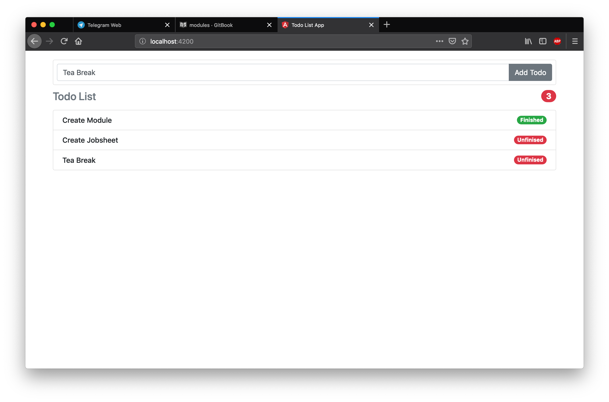
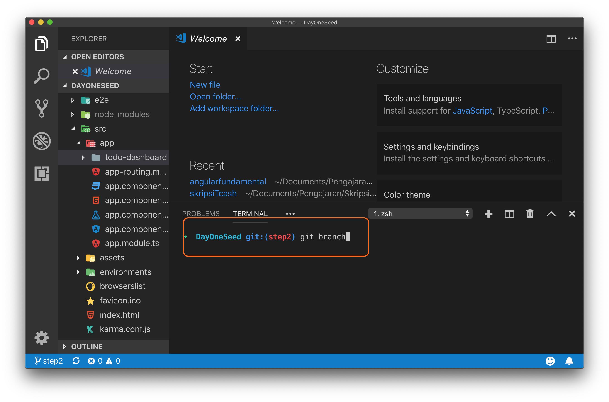
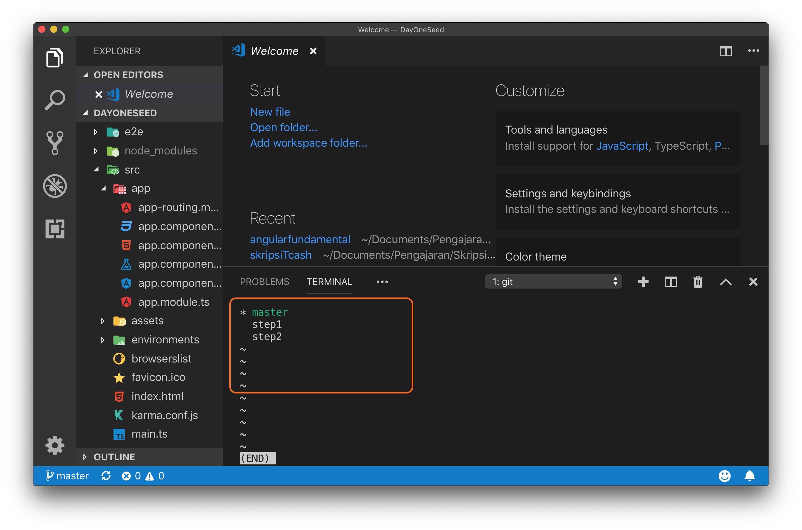
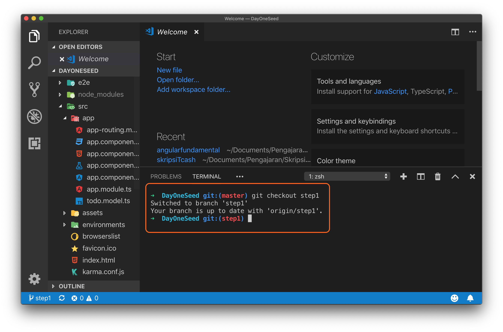
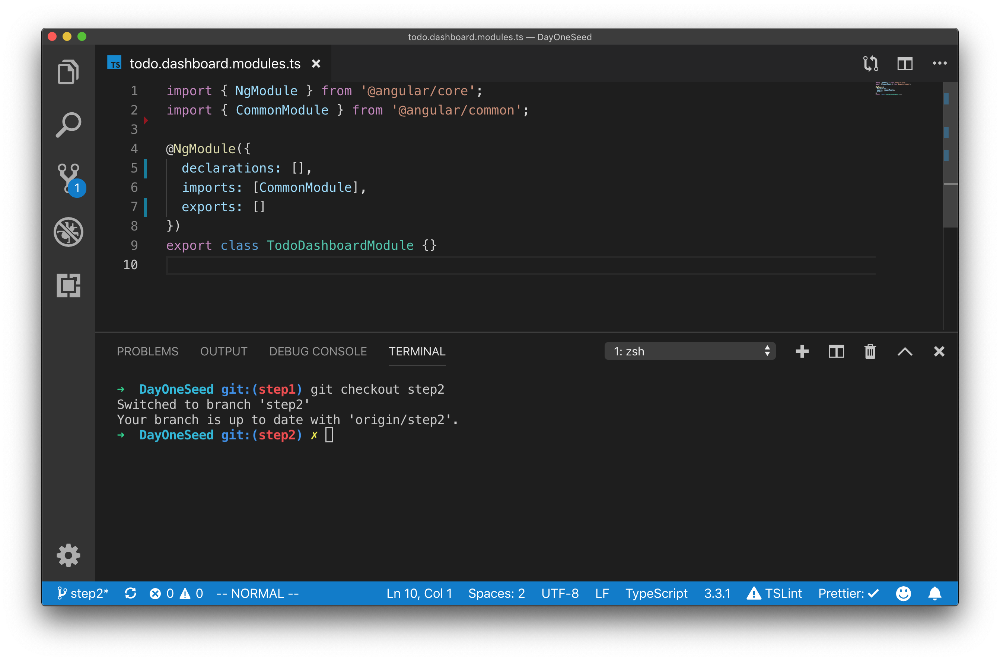

# Feature Modules

Feature modules adalah sebuah module yang berisi component component yang dibutuhkan untuk menyelesaikan suatu tugas atau suatu fitur. Pada percobaaan kali ini setelah anda berhasil memetakan mana yang menjadi Container Component dan mana yang menjadi Presentational Component akan dilanjutkan dengan membuat sebuah feature modules untuk TodoComponent, AddTodoComponent, TodoCountComponent, dan TodoItemComponent dalam sebuah Module TodoDashboard.

> A feature module is an organizational best practice, as opposed to a concept of the core Angular API. A feature module delivers a cohesive set of functionality focused on a specific application need such as a user workflow, routing, or forms. While you can do everything within the root module, feature modules help you partition the app into focused areas. A feature module collaborates with the root module and with other modules through the services it provides and the components, directives, and pipes that it shares.

## Langkah Percobaan

Clone lah repositori berikut ini dari github `https://github.com/siubie/DayOneSeed.git` kemudian bukalah menggunakan visual studio code dan switch dari branch `master` ke branch `step1` setelah berhasil mengganti branch jalankan server angular dengan perintah `ng serve` pastikan aplikasi todo yang ada sekarang berjalan dengan baik.




Branch Step 1 adalah branch yang berisi finished code dari latihan sebelumnya. Pada branch ini sudah berhasil dibuat sebuah aplikasi todo list sederhana dengan fitur add dan toggle finished. Namun pada branch ini masih belum menggunakan konsep pengembangan yang berbasis component dengan baik karena semua kode program di buat di file app.component.ts dan app.component.html.

Pada percobaan ini kita akan membuat sebuah feature module yang bertugas menangani fitur Todo yang ada pada branch Step 1, pada module ini akan di isi dengan container component dan presentational component yang telah di analisa pada modul sebelumnya.

Untuk melaksanakan percobaan ini pastikan bahwa branch yang anda gunakan sekaraang adalah branch `step1`, cara melakukan pengecekan dengan menjalankan perintah berikut ini pada terminal di folder project anda. (pastikan git sudah terinstall pada sistem operasi anda).

```
git branch
```



Hasil perintah git branch dapat anda lihat pada gambar dibawah ini :



Current branch dapat anda lihat dengan mengecek tanda asterisk `*` pada hasil terminal jika berdasarkan gambar diatas branch masih berada pada branch master, untuk itu anda perlu melakukan perubahan untuk pindah ke branch step1 dengan perintah berikut ini.



Setelah berhasil pindah ke branch step1 mari kita lanjutkan dengan membuat sebuah feature module yang bernama `todo-dashboard`, untuk membuatnya mulailah dengan menambahkan folder baru bernama `todo-dashboard` pada folder `app` setelah itu tambahkan dua folder lagi yaitu folder `containers`, `component` dan `models` berikut ini folder tree yang harus dibuat :


Mari dilanjutkan dengan menambahkan sebuah file baru bernama `todo.dashboard.module.ts`, Langkah pembuatan module ini sama degnan langkah pada modul sebelumnya, untuk lebih memahami prosesnya mari kita ulang kembali prosesnya.

Setiap module pada file module angular membutuhkan library dari `@angular/core` yaitu library `ngModule` yang merupakan decorator yang membedakan antara module dengan component dan file lain. Untuk itu pada file `todo.dashboard.module.ts` tambahkanlah statement import berikut ini.

```typescript
import { NgModule } from "@angular/core";
```

Selain itu include can juga library `CommonModule` dari `@angular/common`

```typescript
import { CommonModule } from "@angular/common";
```

Setelah menambahkan ngModule dan CommonModule kita dapat menggunakan decorator @ngModule dan mengimport CommonModule ke Class TodoDashboardModule.

```typescript
import { NgModule } from "@angular/core";
import { CommonModule } from "@angular/common";

@NgModule({
  declarations: [],
  imports: [CommonModule],
  exports: []
})
export class TodoDashboardModule {}
```

Berikut ini hasil kode program `todo.dashboard.module`



Yang barusaja anda buat adalah sebuah template module pada angular dengan library minimal dimana pada module ini nanti akan ditambahkan beberapa component dan container yang digunakan pada module ini.
