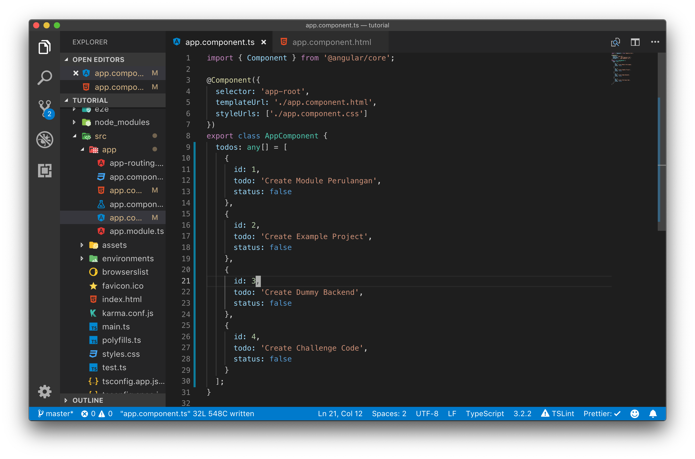
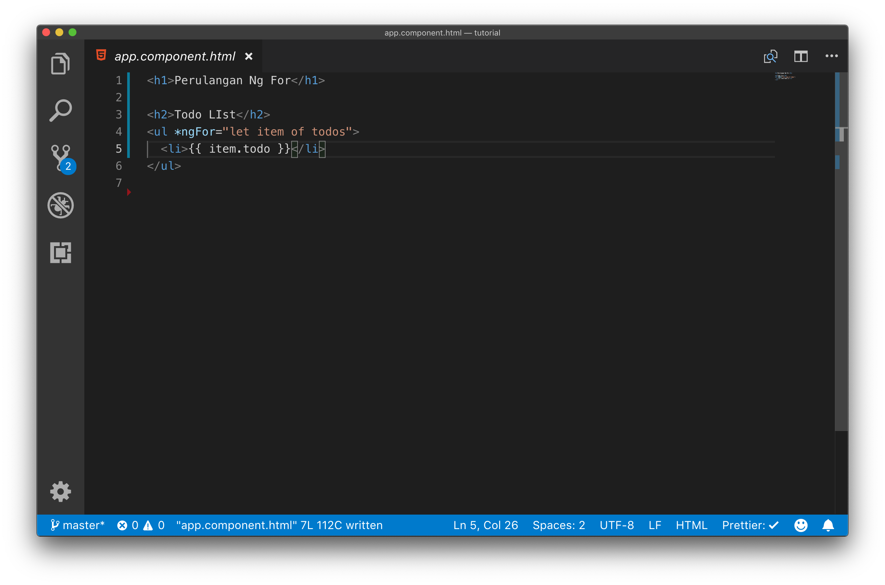
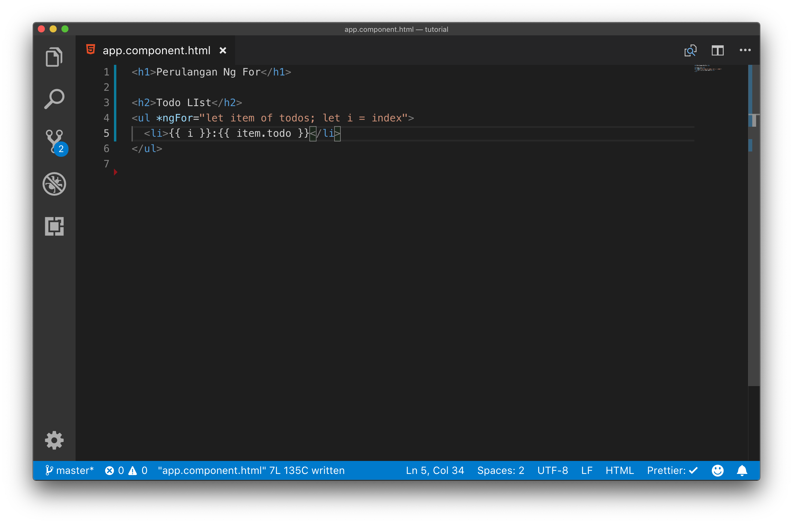
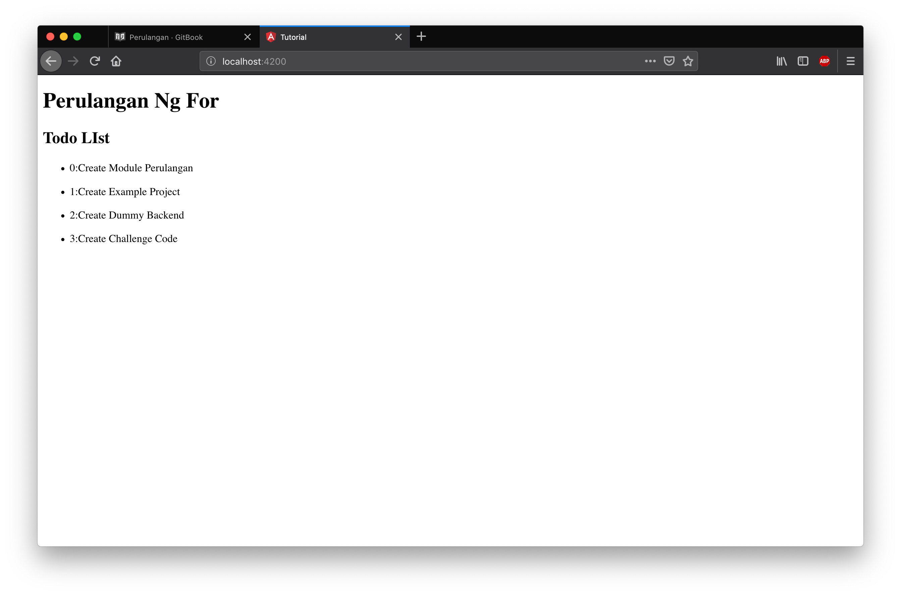

# Perulangan

Perulangan pada angular menggunakan sugar syntax `*ngFor`, perulangan ini dapat dilakukan dengan menggunakan dataset yang didapatkan dari component.

Sintax perulangan dengan `*ngFor` dilakukan pada file template html dari sebuah component, perulangan dapat dilakukan terhadap semua tag html ataupun tag baru dari component lain.

Untuk memahami perulangan dengan `*ngFor` lakukanlah langkah percobaan dibawah ini.

## Langkah Percobaaan

Hapuslah kode program dari percobaan sebelumnya pada file app.component.ts kemudian ubah menjadi seperti gambar dibawah ini.

Pada kode program di atas semua kode program sebelumnya di dalam class AppComponent dihapus kemudian diisikan sebuah variabel baru dengan nama `todos` yang berupa sebuah `arrayOfObjects` dengan tipe data `any` tipe data `any` adalah tipe data yang dapat menerima semua tipe data. `any` digunakan untuk mempermudah langkah percobaan pada tahap ini, untuk production code sebaiknya kita menggunakan variabel yang memiliki tipe data.

Setelah mempunyai varaibel baru, selanjutnya ubah lah file app.component.html dari kode program sebelumnya di ganti menjadi seperti gambar di bawah ini.

Pada kode program diatas kita melakukan perulangan dengan menampilkan `li` sebanyak jumlah data pada variabel `todos`, `*ngFor` dipasangkan pada tag yang melingkupi element yang akan di ulang, dalam hal ini di pasang di tag `ul`

Untuk melihat hasil kode program diatas jalankan server angularnya dengan perintah `ng-serve`, berikut ini hasil dari kode program diatas :

Dalam perulangan tentu saja memiliki index, index pada perulangan sama seperti index pada array yang dimulai dari nol.

Untuk mencoba index pada perulangan ubahlah kode program pada app.component.html menjadi seperti pada gambar dibawah ini

setelah itu bukalah web browser dan liat perubahan apa yang terjadi.

## Challenge Time

> NgFor dan NgIf dapat digabung dalam template html, untuk memahaminya ubahlah tampilan Todo List untuk hanya menampilkan todo yang memiliki id genap atau yang ganjil saja.
