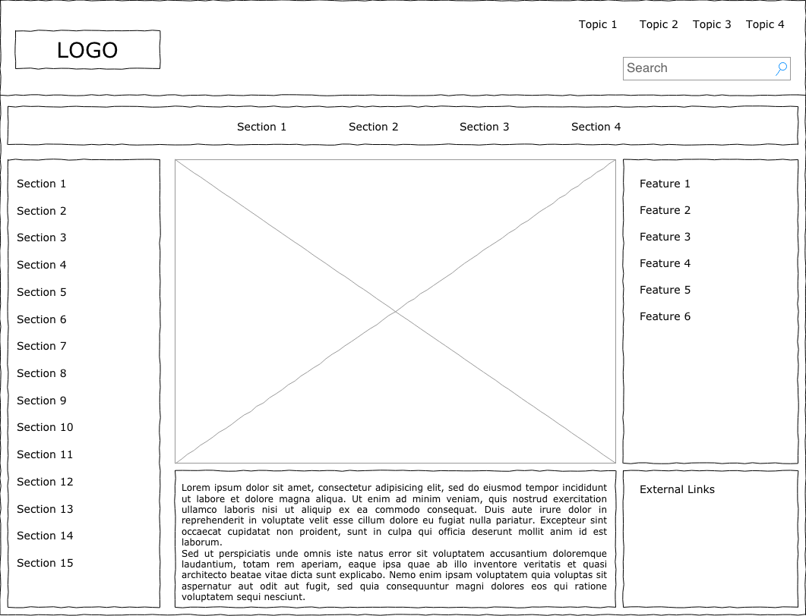

# Kemampuan Akhir Yang Diharapkan
1. Mahasiswa memahami perbedaan antara cara pembuatan frontend dengan angular dan html biasa.
2. Mahasiswa memahami konsep pembuatan frontend dengan angular.
3. Mahasiswa mampu memahami konsep "component" dalam pembuatan frontend.

# Pengenalan Angular

Angular adalah salah satu framework front end yang sedang populer saat ini, angular dikembangkan dengan bahasa pemrograman typescript.

## Angular vs Html
Teknik pembuatan frontend untuk saat ini sudah berkembang dengan sangat pesat, pada beberapa tahun yang lalu pembuatan front end masih menggunakan view yang di render oleh server. Teknik ini menggunakan bahasa pemrograman html untuk tampilan front end dan bahasa pemrograman server side untuk mengatur tampilan dan data.

Kemudian pada dua sampai tiga tahun terakhir pembuatan aplikasi web sudah mengarah kepada pembuatan sistem yang terbagi menjadi dua bagian yaitu back end dan front end. Angular berfokus di pengembangan front end sehingga front end yang pada beberapa tahun yang lalu hanya menampilkan data dari server sekarang sudah berubah tidak sekedar menampilkan data saja namun dapat diprogram sehingga lebih interaktif dan responsif.

## Konsep Pembuatan Front end Dengan Angular

Konsep pembuatan front end dengan angular sangat berbeda dengan pembuatan front end dengan html atau bahasa pemrograman server side biasa. Pada pembuatan front end dengan angular konsep yang sangat penting untuk dipahami adalah  “Segala sesuatu yang dapat dilihat oleh user dibagi sebagai sebuah komponen”. Komponen ini dapat digunakan kembali dan dapat dikombinasikan dengan komponen lain sehingga dapat menjadi sebuah halaman yang dapat digunakan oleh user.

## Konsep Dasar Angular
Angular dibuat berdasarkan konsep component, namun tidak hanya komponen dalam sebuah project angular kita harus memahami konsep konsep dasar yang lain seperti Modules, Component, Services, Directives dan Routing. Kelima konsep inilah yang menjadi dasar pengembangan Angular.

### Modules
Setiap project angular memiliki minimal satu modules. Modules ini lah yang menjadi wadah aplikasi yang menampung component, route, service, directive dan lain lain. Project angular baru minimal memiliki satu module, modul defaultnya adalah AppModule. 

Sebuah Project dapat memiliki lebih dari satu module, contohnya ketika project membutuhkan routing maka dapat ditambahkan routing module. 
 
### Component
Component adalah bagian dari angular yang berisi template, data dan logic. 

Kode program component terdiri dari @Component annotation yang berisi selector, template, dan stylesheet untuk tampilan component ini. Setelah itu pada kode program component juga berisi class typescript yang berisi logika untuk component tersebut.

Data pada component bisa didapat dari service dan dari component ini sendiri. Logic pada component dapat di isi pada kode typescript nya.

Sebuah Component dapat menjadi anak dari component lain atau menjadi parent dari child component nya. Sebuah component juga dapat berinteraksi ke child atau parent nya melalui input dan event.

### Services 
Service pada aplikasi angular merupakan sebuah class yang bertugas melakukan sesuatu yang spesifik untuk membantu jalannya aplikasi, biasanya service digunakan oleh component melalui dependency injections.

Pada aplikasi angular component dan service di pisahkan agar component berfokus pada user sedangkan service berfokus pada "urusan dapur" dari component".

Contohnya jika terdapat sebuah component "search" maka proses menampilkan hasil searching itu dilakukan oleh component sedangkan proses query ke database atau ke REST API dilakukan oleh service.

Perlu dipahami karena service berdiri sendiri maka sebuah service dapat digunakan berulang kali pada component yang berbeda jadi service tidak terikat pada satu component saja.

### Directives 
Pada dasarnya directives adalah sebuah fungsi yang akan dieksekusi oleh angular jika fungsi tersebut ditemukan di DOM. Fungsi fungsi ini digunakan untuk menambah kemampuan halaman html dengan memberikan sintaks baru yang berasal dari directives.
Sintaks baru ini dapat mengubah sifat html yang awalnya statis menjadi lebih dinamis.
Directives ini sudah ada dan disiapkan oleh angular berupa default directives dan pengembang aplikasi dapat menambahkan directives baru.

### Routing 
Routing pada angular berfungsi untuk menampilkan suatu spesific component berdasarkan url yang dibuka, routing merupakan sebuah module angular tersendiri yang bernama RoutingModule.

Module routing ini memberikan kemudahan dalam melakukan navigasi user.

## Latihan

## Tugas
1. Cari lah sebuah website, dan bagilah website tersebut menjadi component component kecil.
2. Dari komponen komponen tersebut susunlah mana yang menjadi parent component dan child component.
3. Desain lah sebuah component tree yang lengkap sehingga website yang anda buka tersebut dapat terbagi menjadi module, component, service, directive dan routing.